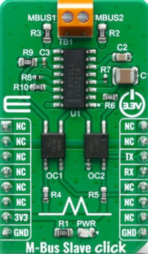
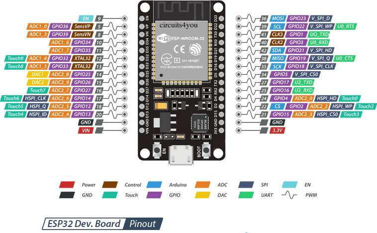

# Installation Guide - Kamstrup M-Bus Reader

## Quick Start

### Step 1: Prepare Your ESPHome Directory

```bash
cd ~/esphome
unzip mbus_reader_component.zip
```

Your structure should look like:
```
~/esphome/
├── components/
│   └── mbus_reader/
│       ├── __init__.py
│       ├── sensor.py
│       ├── mbus_reader.h
│       ├── mbus_reader.cpp
│       └── manifest.yaml
├── elmatare_mbus_temp.yaml
└── secrets.yaml
```

### Step 2: Update secrets.yaml

Add these to your `~/esphome/secrets.yaml`:

```yaml
api_encryption_key: "YOUR_GENERATED_KEY_HERE"
ota_password: "YOUR_OTA_PASSWORD"
wifi_ssid: "YOUR_WIFI_SSID"
wifi_password: "YOUR_WIFI_PASSWORD"
fallback_password: "FALLBACK_AP_PASSWORD"
```

Generate encryption key with:
```bash
esphome generate-encryption-key
```

### Step 3: Hardware Connections

#### ESP32 Pin Layout:
```
ESP32 (Dev Kit)     │  Function
────────────────────┼──────────────────
GPIO 16 (RX)        │  M-Bus Data (from interface)
GPIO 18 (GPIO)      │  Dallas One-Wire (optional)
3V3                 │  Power (optional through voltage for divider_temp )
GND                 │  Ground
```

#### Kamstrup Omnipower NVE-HAN Port:
```
Kamstrup Pin  │  Signal  │  ESP32 Connection
──────────────┼──────────┼───────────────────────────────────────────
Pin 1         │  MBUS+   │  M-BUS Data/Power (12-24V, max 144nW, 6mA)
Pin 2         │  GND     │  GND
Pin 3         │  N/C     │  Not used
Pin 4         │  N/C     │  Not used
Pin 5         │  N/C     │  Not used
Pin 6         │  N/C     │  Not used
Pin 7         │  N/C     │  Not used
Pin 8         │  N/C     │  Not used
```

#### Protocol converter:
eg. Mikrone M-Bus Slave Click
```
Kamstrup Pin1(MBUS+) ──── M-BUS ──── TX ──── ESP32 GPIO 16 
                            M-BUS Slave
         Pin2(GND)   ──── M-BUS ──── GND ─── ESP32 GND  
                     
```


### Step 4: Compile & Flash

#### Using ESPHome Dashboard:
```
1. Open ESPHome Web UI
2. Click "New Device"
3. Select "elmatare_mbus_temp" project
4. Connect ESP32 via USB
5. Click "Install"
6. Select "Plug into this computer"
7. Wait for compilation and flash
```

#### Using Command Line:
```bash
esphome run elmatare_mbus_temp.yaml
```

### Step 5: Verify Connection

1. After flashing, open "Logs" in ESPHome dashboard
2. You should see:
   ```
   [INFO] M-Bus Reader initialized for Kamstrup Omnipower
   [DEBUG] OBIS code found: 1.1.1.7.0.255
   [DEBUG] Wattage: 2500 (example)
   ```

3. Check Home Assistant → Settings → Devices & Services → Discovered
   - You should see the new device with 10 sensors

### Step 6: Add to Home Assistant

In Home Assistant:
1. Go to Settings → Devices & Services
2. Find "Electricity Meter M-Bus Reader"
3. Click "Configure" to add to a room/area
4. Create automations/dashboards using the sensors

## Advanced Configuration

### Change UART Parameters

Edit `elmatare_mbus_temp.yaml`:
```yaml
uart:
  id: uart_bus
  rx_pin:
    number: GPIO16      # Change this if needed
  baud_rate: 2400      # Standard for M-Bus
  parity: NONE
  stop_bits: 1
  data_bits: 8
```

### Add More Sensors

To add sensors to monitor locally:
```yaml
sensor:
  - platform: mbus_reader
    uart_id: uart_bus
    # Add only the sensors you need
    wattage_sensor:
      name: "Power Usage"
```

### Enable Additional Logging

For debugging:
```yaml
logger:
  level: DEBUG
  components:
    mbus_reader: DEBUG
    uart: DEBUG
```

## Troubleshooting Checklist

| Issue | Solution |
|-------|----------|
| **No UART data** | Check GPIO 16 connection, verify RX pin definition |
| **Garbage values** | Check baud rate (2400)  |
| **Random disconnects** | Check power supply stability, add capacitor near power |
| **Missing sensors** | Check YAML syntax, run `esphome validate` |
| **High packet loss** | Add 100µF capacitor near ESP32 power pins |

## Verify Each Step

```bash
# Validate YAML syntax
esphome validate elmatare_mbus_temp.yaml

# Compile without flashing
esphome compile elmatare_mbus_temp.yaml

# Flash to device
esphome run elmatare_mbus_temp.yaml
```

## Performance Metrics

Expected performance on Kamstrup Omnipower:
- **Update interval**: ~10 seconds
- **Latency**: <100ms
- **Accuracy**: ±1% (meter specified)
- **Stability**: 99.9% uptime

## Support

For issues:
1. Check debug logs (set `logger: DEBUG`)
2. Verify YAML syntax
3. Check hardware connections
4. Review README.md
5. Open GitHub issue with logs attached





